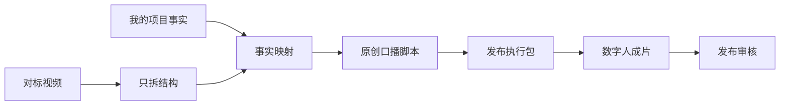
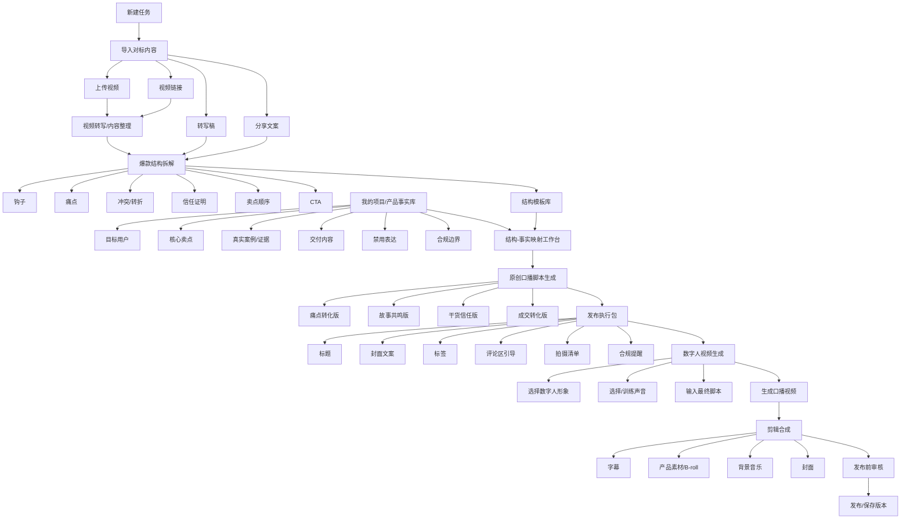
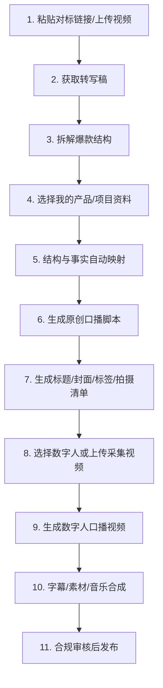
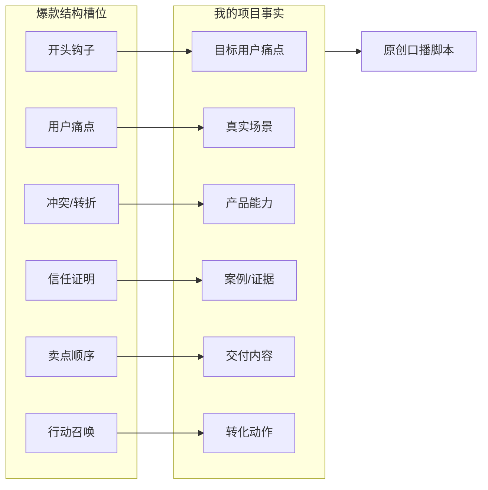
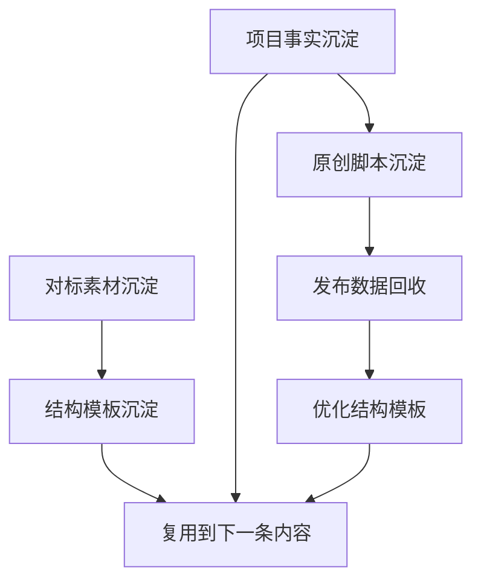

# Nilo 爆款口播工作台可视化方案

## 当前锁定方案：小白成片流水线

Nilo 的前台体验按这条线走：**输入对标链接或上传视频 -> 分析结构与文案 -> 仿写生成脚本 -> 数字人合成 -> 合规审核 -> 生成视频**。

这里的“仿写”是面向用户的易懂说法，产品边界必须写清楚：**仿结构、仿节奏、仿表达路径，不搬运对方原文，不把对方产品信息当成我的项目资料**。

### 小白默认操作步骤

1. 粘贴对标视频链接，或上传对标视频/字幕/文案。
2. 系统整理转写稿，并分析开头、痛点、证明、卖点顺序、转化动作。
3. 用户填写自己的项目资料：卖什么、给谁用、凭什么可信、怎么转化、哪些话不能说。
4. 系统把对标套路匹配到用户项目，生成可拍口播脚本。
5. 用户选择脚本版本，准备标题、封面文案、标签、评论引导和素材清单。
6. 用户选择平台数字人，或上传本人授权采集视频创建数字人。
7. 系统基于脚本合成数字人口播，并做合规审核。
8. 审核通过后进入最终成片生成与记录。

## 一句话定位

**输入对标链接或上传视频，分析套路，仿写脚本，合成数字人成片。**

Nilo 不是洗稿工具，而是一个“对标视频学结构，自己的产品/项目事实定内容”的口播生产系统。

## 核心价值

核心不是“改写一条爆款文案”，而是把爆款视频中可学习的结构拆出来，再用自己的事实重新生成一套原创口播方案。

## 完整业务流程

## 用户操作步骤

## 核心功能模块

| 模块 | 功能 | 关键边界 |
|---|---|---|
| 对标素材库 | 保存视频链接、平台、分享文案、转写稿、数据表现 | 只学习结构，不拿对方产品当自己的内容 |
| 视频转写入口 | 上传视频、粘贴链接、导入字幕或转写稿 | 转写结果进入结构拆解，不直接生成仿写稿 |
| 爆款结构拆解 | 拆钩子、痛点、冲突、证明、卖点顺序、CTA | 拆的是结构，不是逐句改写 |
| 结构模板库 | 保存可复用结构模板 | 模板是抽象结构，不包含原视频可识别表达 |
| 项目事实库 | 保存自己的产品、课程、服务、案例、禁用词 | 所有生成内容必须来自自己的事实 |
| 结构-事实映射 | 把结构槽位和项目事实配对 | 这是原创生成的核心步骤，不能省略 |
| 原创脚本生成 | 生成多个口播版本 | 换场景、换论证、换表达，不洗稿 |
| 发布执行包 | 标题、封面、标签、评论区、拍摄清单、合规提醒 | 面向真实发布，而不是只给文案灵感 |
| 数字人成片 | TTS、数字人、字幕、素材混剪、FFmpeg 合成 | 必须使用已确认的原创脚本 |
| 发布审核 | 检查夸大承诺、授权、敏感词、侵权风险 | 发布前最后一道人工/自动审核 |

## 结构-事实映射示意

## 数字人阶段

数字人阶段是后置生产模块，不是第一核心。它的正确位置是：

### 数字人来源

| 类型 | 是否需要录制视频 | 适用场景 |
|---|---:|---|
| 平台现成数字人 | 否 | 快速出片、测试脚本、矩阵号 |
| 定制数字人分身 | 是 | 老板 IP、创始人 IP、品牌主播、固定账号人设 |

如果做自己的数字人分身，通常需要录制一段授权视频上传采集。平台会用这段视频学习脸部、口型、表情和姿态；如果还要克隆声音，需要单独上传授权音频或朗读素材。

## 产品卖点

1. **不洗稿，只学结构**
   拆的是钩子、痛点、转折、证明和 CTA，不是照着原文改。

2. **基于自己的事实生成**
   内容来自用户自己的项目资料，减少模型胡编和违规风险。

3. **自动做结构-事实映射**
   告诉用户爆款结构里的每一段，应该填自己的哪条卖点、案例或证据。

4. **直接输出可拍脚本**
   输出口播稿、分镜提示、字幕重点和拍摄清单。

5. **一套内容多种版本**
   支持痛点版、故事版、干货版、转化版，方便测试不同方向。

6. **带发布执行包**
   标题、封面文案、标签、评论区引导、合规提醒一次生成。

7. **沉淀内容资产**
   对标素材、结构模板、项目事实、历史脚本都能复用。

## 适用人群

| 人群 | 使用价值 |
|---|---|
| 老板 IP / 创始人 IP | 把项目讲成清晰、有转化力的口播内容 |
| 短视频运营 | 标准化拆对标、写脚本、做发布包流程 |
| 电商商家 / 带货团队 | 学爆款结构，同时降低洗稿和违规风险 |
| 知识付费 / 咨询服务 | 把课程、服务、案例包装成可信口播 |
| AI 工具 / SaaS 团队 | 快速产出产品介绍、痛点种草、功能演示脚本 |
| 普通内容创作者 | 从“看懂爆款”升级到“迁移结构” |

## 操作难度

整体目标：**低门槛，中等专业度，高复用价值。**

用户只需要会做三件事：

1. 复制对标链接或上传视频。
2. 填写自己的产品/项目事实。
3. 检查系统生成的结构映射和脚本。

真正有一点门槛的是“项目事实填写”。因此产品里必须内置项目事实模板，帮助用户补全目标用户、卖点、案例、交付和禁用表达。

## 产品边界

- 不是洗稿工具。
- 不是保证爆款工具。
- 不是自动绕过平台审核工具。
- 不克隆未授权声音或肖像。
- 不把对标视频里的产品信息当成用户自己的项目事实。
- 不编造资质、销量、案例、收益和效果承诺。

## 最终闭环

最终，Nilo 要沉淀的不是一条脚本，而是用户自己的：

- 对标素材资产
- 结构模板资产
- 项目事实资产
- 脚本版本资产
- 发布复盘资产

## 功能按键提示规范

所有关键按钮必须让用户明确三件事：**点了会发生什么、需要满足什么前置条件、完成后下一步去哪。**

### 按钮提示原则

1. **按钮文案要说结果，不只说动作**
   例如用“拆解爆款结构”，不要只写“开始”。

2. **按钮下方或 hover 提示要说明前置条件**
   例如“需要先填写对标内容和项目事实”。

3. **禁用按钮要说明原因**
   例如“请先完成结构拆解后再生成脚本”。

4. **高风险按钮必须提示边界**
   例如数字人、声音克隆、发布审核相关按钮必须提示授权和合规要求。

5. **长流程按钮要提示预计耗时**
   例如转写、生成脚本、数字人成片都要显示预计时间和当前状态。

### 核心按钮清单

| 阶段 | 按钮 | 默认提示 | 禁用/风险提示 | 完成后引导 |
|---|---|---|---|---|
| 新建任务 | 新建任务 | 创建一条新的口播生产任务 | 当前草稿会保留到历史记录 | 进入对标素材导入 |
| 对标素材 | 粘贴链接并解析 | 识别平台并记录对标来源 | 请输入抖音/视频号/小红书等视频链接 | 进入转写或文案整理 |
| 对标素材 | 上传视频 | 上传本地对标视频用于转写 | 单个文件大小、格式、授权提示 | 进入视频转写 |
| 对标素材 | 导入转写稿 | 直接使用已有口播稿拆结构 | 文本过短无法稳定拆解 | 进入结构拆解 |
| 视频转写 | 开始转写 | 将视频转成可拆解口播文本 | 视频未上传或链接未解析 | 检查转写稿 |
| 结构拆解 | 拆解爆款结构 | 只提取结构，不复刻原文 | 缺少对标内容时不可用 | 进入结构模板确认 |
| 结构模板 | 保存为结构模板 | 将当前拆解结果沉淀为可复用模板 | 结构字段不完整时提示补全 | 进入事实映射 |
| 项目事实 | 新建项目事实 | 创建自己的产品/项目资料档案 | 必须填写目标用户和核心卖点 | 进入结构-事实映射 |
| 项目事实 | 从事实库选择 | 选择已有产品/项目资料 | 未选择时不能生成脚本 | 进入结构-事实映射 |
| 事实映射 | 自动映射 | 将结构槽位匹配到自己的项目事实 | 缺少事实字段时标红提醒 | 人工检查映射结果 |
| 事实映射 | 确认映射 | 锁定本次脚本生成依据 | 未确认映射时不能生成脚本 | 进入原创脚本生成 |
| 脚本生成 | 生成原创脚本 | 基于结构和项目事实生成多版本脚本 | 未完成映射时不可用 | 选择脚本版本 |
| 脚本生成 | 重新生成此版本 | 保留结构和事实，换一种表达 | 会覆盖当前版本草稿 | 检查新版本 |
| 脚本生成 | 锁定最终脚本 | 将此脚本作为发布包和数字人成片依据 | 锁定后仍可另存新版本 | 进入发布执行包 |
| 发布包 | 生成发布包 | 生成标题、封面、标签、评论区和拍摄清单 | 未锁定最终脚本时不可用 | 进入合规审核 |
| 合规审核 | 检查风险 | 检查夸大承诺、授权和敏感表达 | 仅提示风险，不替代人工判断 | 修改或确认发布包 |
| 数字人 | 选择数字人形象 | 使用现成数字人或自定义分身 | 自定义分身需要授权采集视频 | 进入声音选择 |
| 数字人 | 上传采集视频 | 上传本人授权录制视频训练数字人 | 必须确认肖像授权 | 等待形象训练 |
| 数字人 | 选择/训练声音 | 使用系统音色或授权声音 | 禁止未授权声音克隆 | 进入口播视频生成 |
| 数字人 | 生成数字人口播 | 用最终脚本生成口型同步视频 | 脚本未锁定或授权未确认不可用 | 进入剪辑合成 |
| 剪辑合成 | 生成成片 | 合成字幕、素材、音乐和数字人视频 | 素材缺失时提示可跳过 | 进入发布审核 |
| 发布记录 | 保存版本 | 保存本次任务、脚本和发布包 | 无任务内容时不可保存 | 可复制复用 |

### 按钮状态设计

| 状态 | UI 表现 | 提示内容 |
|---|---|---|
| 可点击 | 高亮主按钮 | 明确说明点击后的结果 |
| 禁用 | 降低透明度，禁止点击 | 说明缺少什么前置条件 |
| 处理中 | loading、进度条、预计耗时 | 显示当前处理阶段 |
| 成功 | 绿色/完成标记 | 显示下一步推荐动作 |
| 失败 | 红色/警告标记 | 显示失败原因和重试入口 |
| 高风险 | 黄色/红色提示 | 显示授权、合规或覆盖风险 |

### 页面级引导

每个阶段顶部应有一句短提示：

- 对标素材：上传或粘贴对标内容，系统只会学习结构。
- 结构拆解：这里拆的是表达结构，不会复刻原文。
- 项目事实：这里填写你自己的项目资料，不是对标视频里的产品。
- 事实映射：把爆款结构槽位匹配到你的真实卖点和案例。
- 脚本生成：基于已确认映射生成原创口播版本。
- 发布包：将脚本变成可发布的标题、封面、标签和拍摄清单。
- 数字人成片：使用已确认脚本生成视频，声音和肖像必须授权。

### 关键体验要求

- 用户永远知道自己处在哪一步。
- 用户永远知道当前按钮为什么能点或不能点。
- 用户永远知道点击后会进入哪个阶段。
- 涉及授权、合规、覆盖历史版本的按钮必须二次确认。
- 不允许出现“按钮有反馈但用户不知道结果保存在哪里”的情况。
